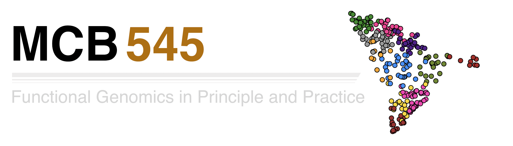

 # 

## MCB545 Course Overview

This course is focused on experimental and analytical foundations of functional genomics, tailored to experimental biologists who are interested in using high-throughput sequencing technologies to analyze function in animal genomes. Lectures will cover the experimental methods and the tools available for data analysis; students will gain experience in bioinformatics tools through assignments and group projects. 

## Learning Objectives

At the end of the course, through assignments, discussions, activities and assessments, students will be able to:
•    Understand basic principles of modern functional genomics methods and current sequencing approaches 
•    Navigate and utilize a high-performance computing (HPC) cluster environment
•    Apply data processing and quality control pipelines to evaluate high-throughput sequencing data 
•    Perform computational analysis of sequencing-based genomic assays (RNA-seq, ChIP-seq, eCLIP, etc.). 
•    Interpret common data visualization techniques and apply these approaches using R 
•    Integrate multi-omic data to generate hypotheses related to the regulation and function of a given gene(s) of interest.

## Grading Information and Breakdown

20% Class participation: includes attendance and group participation (20 points total)
20% Graded homework assignments (20 points total)
40% Graded project assignments/presentations (2 total, 20 points each)
20% Final project assignment (20 points total)

100 Total points
Grade format = ABCDF, plus/minus
90% = A, 80% = B, 70% = C, etc.
