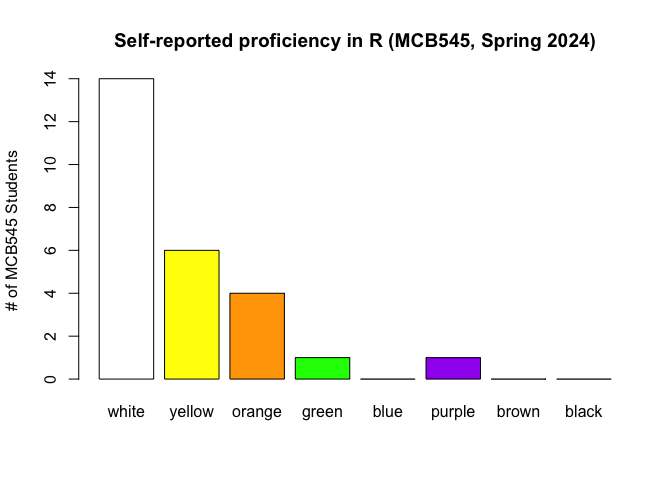
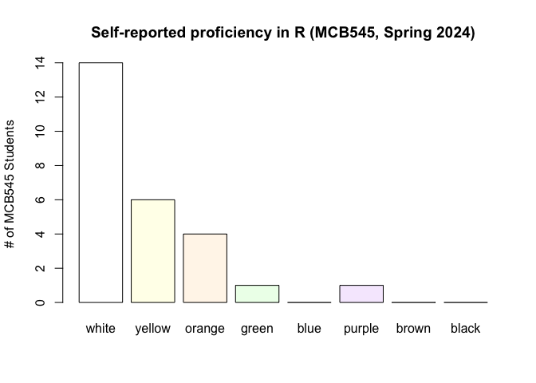

<br> MCB545 Class \#3: Intro to R and Rstudio <br> <sub> *Week 2
Exercise: Gene annotation for my RBP*
================
<br>

------------------------------------------------------------------------

## Section 1: Getting started

------------------------------------------------------------------------

### Why R?

R is a programming language and software environment used for
statistical analysis, graphical representation, and reporting.
Originating in the statistics community, R has become a major tool in
data science, bioinformatics, and many other fields.

- **Statistical Analysis**: R is built for statistics, making it ideal
  for complex analyses.
- **Open Source**: It’s free to use and has a large community
  contributing to its development.
- **Flexibility**: R can be integrated with other languages and can
  handle various data types and sources.
- **R Packages**: A massive set of libraries for various purposes
  including graphical tools and statistical techniques.

### Installing R and RStudio

- **R Installation**: Visit [CRAN](https://cran.r-project.org) and
  select the version for your operating system.
- **RStudio Installation**: Download RStudio from [RStudio’s
  website](https://rstudio.com/products/rstudio/download/). RStudio is
  an IDE (integrated development environment) for R.

### Exploring the RStudio Interface

- Overview of RStudio panes: Console, Script, Environment, and
  Files/Plots/Packages/Help.

### R Markdown files

This is an [R Markdown](http://rmarkdown.rstudio.com) document. Markdown
is a simple formatting syntax for authoring HTML, PDF, and MS Word
documents. We will use R Markdown **.Rmd** files for MCB545 class
exercises and assignments.

When you click the **Knit** button a document will be generated that
includes both content as well as the output of any embedded R code
chunks within the document. Think of this document as a report for each
of your assignments.

Code chunks are embedded in Markdown files, like this:

``` r
knitr::opts_chunk$set(echo = TRUE)
```

Purpose of Triple Backticks: In Markdown and R Markdown, triple
backticks are used to denote the start and end of a code block. Anything
written between these backticks is treated as code and is formatted
differently from the rest of the text. This is crucial for readability
and clarity, especially when mixing narrative text with code snippets.

The triple backticks can be followed by a language identifier (like r
for R, python for Python, etc.) to enable syntax highlighting specific
to that language. For example, \`\`\`{r} for R code blocks in R
Markdown.

The triple backticks in R Markdown are followed by curly braces {r} to
indicate the beginning of an R code chunk. Inside these chunks, you can
write R code that will be executed to produce output (like graphs or
tables) in the final document.

While triple backticks are used for code blocks (larger sections of
code), single backticks are used for inline code. Inline code is used
when you want to refer to a piece of code within a line of text, like
mentioning a variable `x` or a function `sum()`.

Above, we created a chunk of R code by specifying the programming
language as R. We also added a title to the chunk (“Intro to Knitr”).
*Note: Do not worry about understanding the code here yet, which is
simply setting an option to include code chunks in the final output*

------------------------------------------------------------------------

## Section 2: Basic Concepts in R

------------------------------------------------------------------------

### Variables and Data Types

``` r
# Creating variables
x <- 42
y <- "Genomics is fun!"
```

In R, a comment is created by putting a `#` symbol at the beginning of
the line. Everything following the `#` on that line is treated as a
comment.Comments are non-executable, which means the R interpreter
ignores them when running the code. They are purely for human
understanding.

In R, we use the `<-` symbol to assign values to variables. Think of it
as an arrow pointing the value to the variable. This is how we store
values in variables, allowing us to use and manipulate them later in our
code. Although you might also see `=`, the `<-` is the traditional R way
of assigning values

A variable in R is created with a name (x, and y, above), which is a way
to identify the stored data. The name can consist of letters, numbers,
dots (.), and underscores (\_), but it must start with a letter or a dot
not followed by a number. Case sensitivity is important in R, so Var,
var, and VAR would be considered different variables.

``` r
# Data types: Numeric, Character, Logical
is.numeric(x)
```

    ## [1] TRUE

``` r
is.character(y)
```

    ## [1] TRUE

The value assigned to a variable in R can be of various data types,
including numeric, character, logical, etc., and can also be more
complex data structures like vectors, matrices, data frames, or lists.
Notice that variable x is numeric, and variable y is character. The
value stored in a variable is not fixed and can be changed, meaning
their values can be modified after they are created.

### Functions in R

Functions are one of the key building blocks of programming in R. They
allow you to encapsulate a sequence of operations into a single,
reusable unit. This can greatly enhance the readability and
maintainability of your code. We use many base functions in R (i.e., see
`is.numeric()` and `is.character()` above), but we can also create our
own functions and acquire functions written by others by installing R
packages. A function in R is a set of instructions that performs a
specific task. It usually takes some input (known as arguments),
processes them, and returns a result.

The basic structure of a function in R is as follows:

``` r
my_function <- function(arg1, arg2) {
    # Function body
    result <- arg1 + arg2
    return(result)
}
```

To use a function, you call it by its name and pass the required
arguments:

``` r
my_function(10, 20)
```

    ## [1] 30

Note that we just created a simple function that adds two arguments,
there’s a base function in R for that:

``` r
sum(10,20)
```

    ## [1] 30

But wait, I don’t know what the function `sum()` does (ok, in this case
it’s self-explanatory but not always!) or what arguments this function
expects. I need help!

### Finding Help in R

An essential skill in programming is knowing how to find help and
documentation. R has built-in help features that allow you to access
documentation easily. One of the most straightforward ways to find help
in R is using the help function, represented by the `?` symbol.

Whenever you need information about a specific function, dataset, or
general topic in R, you can use the `?` followed by the topic’s name.
This command will open the relevant help page in R. To use the help
function, simply type `?` followed by the name of the function or
dataset you want information on. For example:

``` r
# To get help on the sum function
?sum
# Or, you can use help()
help(sum)
```

------------------------------------------------------------------------

## Section 3: Importing data in R

------------------------------------------------------------------------

Often, the first step in data analysis is importing data from external
sources. One common format for data is tab-delimited text files. R
provides the `read.delim()` function to import these types of files
easily. It assumes that your data is tab-separated and that the first
row contains the column headers (or, you can set argument HEAD=FALSE if
you do not have column headers, try using the help function referenced
above to learn more about this function)

### read.delim() for importing tab-delimited files

The basic syntax of `read.delim()` is:

``` r
# typically you will retrieve files on your local computer, here we want to visit the R proficiency poll results:
R_poll = read.delim("https://raw.githubusercontent.com/kvbortle/MCB545_FunctionalGenomics/main/class03_Programming_in_R/R_proficiency_SP24.txt")
```

Ok, we just imported a tab-delimited file, how do we explore what’s in
the file?

``` r
head(R_poll)
```

    ##   white yellow orange green blue purple brown black
    ## 1     1      0      0     0    0      0     0     0
    ## 2     1      0      0     0    0      0     0     0
    ## 3     0      1      0     0    0      0     0     0
    ## 4     0      1      0     0    0      0     0     0
    ## 5     0      0      0     1    0      0     0     0
    ## 6     1      0      0     0    0      0     0     0

The R function head() displays the first 5 lines of the object R_poll,
you can change it by modified the option n, for example:

``` r
head(R_poll, n = 10)
```

    ##    white yellow orange green blue purple brown black
    ## 1      1      0      0     0    0      0     0     0
    ## 2      1      0      0     0    0      0     0     0
    ## 3      0      1      0     0    0      0     0     0
    ## 4      0      1      0     0    0      0     0     0
    ## 5      0      0      0     1    0      0     0     0
    ## 6      1      0      0     0    0      0     0     0
    ## 7      0      0      1     0    0      0     0     0
    ## 8      0      0      1     0    0      0     0     0
    ## 9      0      1      0     0    0      0     0     0
    ## 10     1      0      0     0    0      0     0     0

The R function str() displays the structure of our R object:

``` r
str(R_poll)
```

    ## 'data.frame':    26 obs. of  8 variables:
    ##  $ white : int  1 1 0 0 0 1 0 0 0 1 ...
    ##  $ yellow: int  0 0 1 1 0 0 0 0 1 0 ...
    ##  $ orange: int  0 0 0 0 0 0 1 1 0 0 ...
    ##  $ green : int  0 0 0 0 1 0 0 0 0 0 ...
    ##  $ blue  : int  0 0 0 0 0 0 0 0 0 0 ...
    ##  $ purple: int  0 0 0 0 0 0 0 0 0 0 ...
    ##  $ brown : int  0 0 0 0 0 0 0 0 0 0 ...
    ##  $ black : int  0 0 0 0 0 0 0 0 0 0 ...

Notice that the data structure of R_poll is `data.frame`, we have 8
variables of data type `int` (Integer) with 26 observations for each.
*Note, here every observation represents a student, 1 represents the
self-reported proficiency, 0 represents a selection that was note
chosen*

Another useful function is `summary()`, which provides some basic
statistics for each variable:

``` r
summary(R_poll)
```

    ##      white            yellow           orange           green        
    ##  Min.   :0.0000   Min.   :0.0000   Min.   :0.0000   Min.   :0.00000  
    ##  1st Qu.:0.0000   1st Qu.:0.0000   1st Qu.:0.0000   1st Qu.:0.00000  
    ##  Median :1.0000   Median :0.0000   Median :0.0000   Median :0.00000  
    ##  Mean   :0.5385   Mean   :0.2308   Mean   :0.1538   Mean   :0.03846  
    ##  3rd Qu.:1.0000   3rd Qu.:0.0000   3rd Qu.:0.0000   3rd Qu.:0.00000  
    ##  Max.   :1.0000   Max.   :1.0000   Max.   :1.0000   Max.   :1.00000  
    ##       blue       purple            brown       black  
    ##  Min.   :0   Min.   :0.00000   Min.   :0   Min.   :0  
    ##  1st Qu.:0   1st Qu.:0.00000   1st Qu.:0   1st Qu.:0  
    ##  Median :0   Median :0.00000   Median :0   Median :0  
    ##  Mean   :0   Mean   :0.03846   Mean   :0   Mean   :0  
    ##  3rd Qu.:0   3rd Qu.:0.00000   3rd Qu.:0   3rd Qu.:0  
    ##  Max.   :0   Max.   :1.00000   Max.   :0   Max.   :0

### Other functions for reading in files:

Keep in mind that we may not always be working with tab-delimited files,
and that using other functions may be more useful, such as `read.csv()`
for comma separated values (.CSV). There are also methods that speed up
reading in extraordinarily large files, such as the `fread()` function
from the R package,
[data.table](https://cran.r-project.org/web/packages/data.table/vignettes/datatable-intro.html)

------------------------------------------------------------------------

## Section 4: Plotting in R

------------------------------------------------------------------------

There are several functions in base R for data visualization. Let’s use
the function `barplot()` to visualize the distribution of self-reported
proficiencies in R programming at the start of this course. First let’s
make a vector of the total number of self-reported programmers at each
belt level, using the `colSums` function:

``` r
tally = colSums(R_poll)
print(tally)
```

    ##  white yellow orange  green   blue purple  brown  black 
    ##     14      6      4      1      0      1      0      0

Now, we can plot these entries with the `barplot()` function. The column
names are conveniently the color we wanted for each barplot, so we can
supply them to the `col` option in barplot (below)

``` r
barplot(tally, col=colnames(R_poll), ylab="# of MCB545 Students", main="Self-reported proficiency in R (MCB545, Spring 2024)")
```

<!-- -->

------------------------------------------------------------------------

## Section 5: Subsetting in R

------------------------------------------------------------------------

We will often want to subset on a specific variable or condition, as a
simple example, how can we retrieve only the information from `R_poll`
in which the student self-reported a proficiency of “Purple Belt in R
programming”.

### subset() function in R

One method involves using the `subset()` function in R

``` r
purp = subset(R_poll, purple == 1)
print(purp)
```

    ##    white yellow orange green blue purple brown black
    ## 20     0      0      0     0    0      1     0     0

Note here that `subset()` expects a logical expression indicating
elements or rows to keep, missing values are taken as false. Here, my
condition is that the variable purple is 1. The `==` operator is used to
test if two values are equal. It compares the value on its left with the
value on its right and returns TRUE if they are equal and FALSE
otherwise.The `!=` operator is used to test if two values are not equal.
It compares the value on its left with the value on its right and
returns TRUE if they are not equal and FALSE if they are equal.

### Brackets for subsetting

Brackets `[]` are used to subset objects like vectors, matrices, and
data frames by specifying indices or conditions directly. For example,
knowing that the student self-reported as a Purple Belt in R is the 20th
row, we can easily subset for row 20 using brackets:

``` r
purp = R_poll[20,]
print(purp)
```

    ##    white yellow orange green blue purple brown black
    ## 20     0      0      0     0    0      1     0     0

Here, rows and columns are separated by a comma. We have selected the
20th row by placing 20 before the comma. By not including a value after
the comma, we are not subsetting for any column (so, all columns are
included). What if we only wanted the value in the 20th row AND the 6th
column?

``` r
purp = R_poll[20,6]
print(purp)
```

    ## [1] 1

*Note that we can also use brackets for one-dimensional structures, in
which you can select specific entries:*

``` r
tmp = R_poll[,6]
# What did we do here? we've selected column 6, now tmp is a 1-dimensional vector
print(tmp)
```

    ##  [1] 0 0 0 0 0 0 0 0 0 0 0 0 0 0 0 0 0 0 0 1 0 0 0 0 0 0

``` r
tmp = tmp[20]
# What did we do here? We've selected the 7th entry in a 1-dimensional vector. A comma will not work
print(tmp)
```

    ## [1] 1

We can also combine brackets with conditions:

``` r
tmp = row.names(R_poll)[R_poll$white == 1]
print(tmp)
```

    ##  [1] "1"  "2"  "6"  "10" "12" "13" "14" "15" "16" "17" "19" "23" "25" "26"

This process may not be immediately straightforward, but once you become
comfortable with it, it offers a very quick & easy approach for
subsetting

------------------------------------------------------------------------

## Section 6: Installing packages in R

------------------------------------------------------------------------

### CRAN (install.packages)

The most commonly used R packages are available through the CRAN
repository (Comprehensive R Archive Network). Let’s revisit our plot
above, but use a function from the [scales](https://scales.r-lib.org/) R
package to introduce transparency to our plot

``` r
install.packages("scales")
```

Once installed, we need to use the `library()` function to make the
“scales” package functions become available to us, we specifically want
to make use of the `alpha()` function to add transparency to our colors:

``` r
library("scales")

barplot(colSums(R_poll), col=alpha(colnames(R_poll), 0.1), ylab="# of MCB545 Students", main="Self-reported proficiency in R (MCB545, Spring 2024)")
```

<!-- -->

### Bioconductor (BiocManager)

Bioconductor is an open-source project that provides tools for the
analysis of high-throughput genomic data. It’s widely used in the field
of computational biology and integrates with the R programming
environment, offering a wide range of specialized packages for genomic
data analysis.

Bioconductor packages are not part of the standard R package repository
(CRAN), so they are installed using a specific Bioconductor installation
function.

``` r
if (!requireNamespace("BiocManager", quietly = TRUE))
    install.packages("BiocManager")

BiocManager::install()
```

This code checks if BiocManager is installed (the package used to
install Bioconductor packages) and installs it if it’s not already
present. Then, it uses BiocManager::install() to set up
Bioconductor.Once Bioconductor is set up, you can install individual
packages using BiocManager::install().

------------------------------------------------------------------------

## Section 7: Class Exercise: Gene size distributions

------------------------------------------------------------------------

``` r
genes = read.delim("https://raw.githubusercontent.com/kvbortle/MCB545_FunctionalGenomics/main/class03_Programming_in_R/Ensembl_Genes_v109.txt")
head(genes)
```

    ##          Gene Ensembl_Gene_ID Chromosome Gene_start Gene_end
    ## 1     DDX11L2 ENSG00000290825          1      11869    14409
    ## 2     DDX11L1 ENSG00000223972          1      12010    13670
    ## 3      WASH7P ENSG00000227232          1      14404    29570
    ## 4   MIR6859-1 ENSG00000278267          1      17369    17436
    ## 5 MIR1302-2HG ENSG00000243485          1      29554    31109
    ## 6   MIR1302-2 ENSG00000284332          1      30366    30503

Building on Monday’s lecture about Genome and Gene builds and what we’ve
covered so far in R, let’s retrieve the Ensembl annotation for genes
(version 109) and begin looking at basic details related to our
RBP-encoding genes

\[1\] Given the information provided in the variable `genes` above, how
would you determine the size of all genes? <br> \[2\] How would you
subset on YOUR gene of interest? <br> \[3\] How does the size of YOUR
gene compare to the distribution of annotated genes? *hint, we will use
another base R plot function: `hist()`*

<br> <br>
